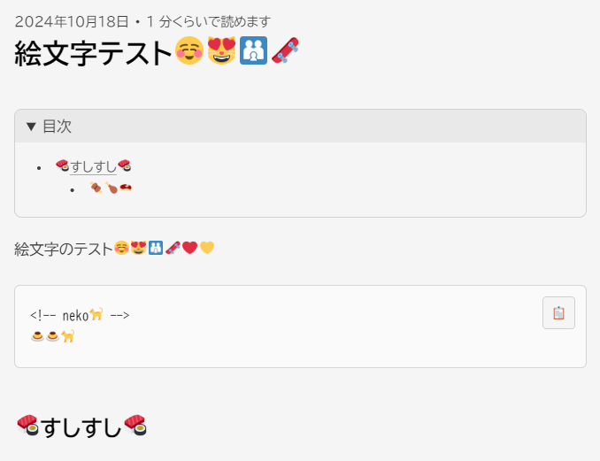
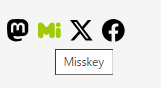
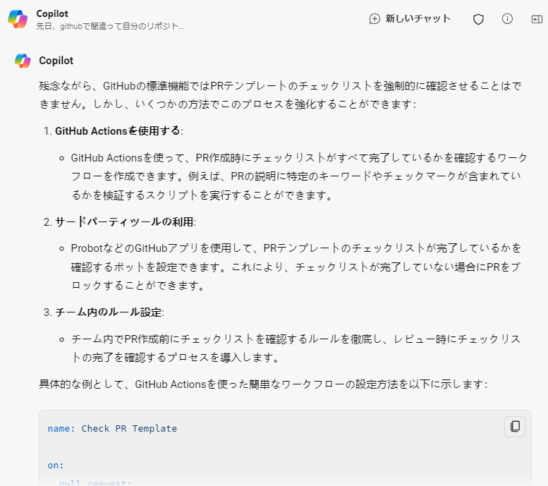

## お勉強難しいけど楽しい
このWebサイトは勉強がてら構築していることは[以前のブログ](/blog/first-commit)にも書きました。

あれからちょっとずつ自分好みのWebサイトになるように改造を進めています。現時点で2つほど大きな変更を加えたので、ちょっとご紹介。

### Twemoji化

Misskeyでデフォルトで採用されているTwemojiを、このWebサイトにも適用しました。Misskeyの埋め込みウィジェット内と記事のUnicode絵文字フォントがバラバラなのが解消されて、統一感が出た気がします。  
Windows/macOS/iOS/Androidと、閲覧環境が違っても同じ絵文字が表示されるようになりました。

Twemoji好きなんですよね、フラットで可愛げがあって……。コミットログは相当ぐちゃぐちゃですが、不格好であっても、こうしたいなーと思ってたことが実装できるとちょっとうれしいね。  

適用の流れは大まかにこんな感じでした。
- Twemojiのjavascriptを`head`タグ部分のコンポーネントに追加
- `twemoji.parse(document.body);` となるようにコンポーネントを修正
- 表示をcssで整える

すっごい雑です。たぶん最適化するならもっといい方法があると思うし、一部レイアウトが崩れているのもちょっと気になる（上のスクショでいうと目次の下線部が適用されていない）。まあそのあたりはおいおいやっていくということで……。

### Shareボタンを追加

「Astro Social Button 🔍」で愚直に検索をかけた結果、[astro-social-share](https://github.com/silent1mezzo/astro-social-share)というそのものずばりなパッケージが公開されていたので、forkして使っています。  

ブログのlight/darkテーマに各種ボタンを対応させたのと、デフォルトにはMastodonとMisskeyがなかったので、コードを眺めながら見よう見まねで作ってみました。

テーマの対応自体はtailwindCSSのおかげで簡単でしたが、ボタンを新しく追加するとなるとちょっと工夫が必要でした。特にMastodon。

Misskeyのボタンを押すと、[Misskey Hubの共有フォーム中継サービス](https://misskey-hub.net/ja/docs/for-users/features/share-form/#misskey-hub%E3%81%AE%E5%85%B1%E6%9C%89%E3%83%95%E3%82%A9%E3%83%BC%E3%83%A0%E4%B8%AD%E7%B6%99%E3%82%B5%E3%83%BC%E3%83%93%E3%82%B9%E3%81%AB%E3%81%A4%E3%81%84%E3%81%A6)を経由して、投稿したいサーバを選ぶページに飛びます。そこでアカウントのあるサーバーを入力してから進むと、各サーバで投稿画面が開く、という仕組みになってます。おすすめサーバが選択できたので [misskey.resonite.love](https://misskey.resonite.love/) を設定してみました。

Misskey HubはMisskey開発陣が運用しているサイトでオフィシャルなものなので、それに乗っかる形でボタンをつくることができました。

問題はMastodonのほう。Mastodonにはそういったポータルサイト的なものは存在しない？らしく、先人たちによる様々な知恵や、はたまた自前で実装したりといった知見が転がっていました。

あれこれやってみた結果、Mastodonは [Add to Any](https://www.addtoany.com/)というサービスを経由することにしました。ボタン自体は自前で用意するので、サーバ選択画面だけ使う感じです。  
類似サービスはほかにもいろいろあるので、選択画面がシンプルで分かりやすいのがあればそっちを使いたいな～と思っています。

## PRでやらかした😭

なお、パッケージをforkしてPullRequestを作ったぜ！さてMerge……となったときに、PR先がfork元になっていることに気づいて血の気が引きました。  
間違って作っちゃったPRをいったんクローズして、お詫びのコメントをしたものの、PR自体の削除はできないらしい。完全にやらかしました。  

こういう過ちがあったのでPR作るとき「ほんまにそこ宛でええんやな？」って確認してくれるような、機械的に防ぐ方法が知りたい。

ということでAI先生に聞いてみると、PRテンプレートにチェックボックスをつくって、チェックされているか監視するようにしたらええんちゃうか？との回答を得ました。  

チェックボックスが`[x]`（チェック済）となっているかを確認するworkflowを書くところまでやってくれました。試しに設定してみたのですが、これではPR作成後にworkflowが実行されるので、あまり今回の対策としては有効じゃないかも……。  

とはいえ自作自演でPR・review・mergeする運用にしているので、流れでうっかりmainブランチに直接pushしないように、こういったチェックを入れていくの大事だな～と思いました。OSSにPR送れるようになるまで（そんな日が来るのか？）、しっかり自分のリポジトリで勉強しようと思います。