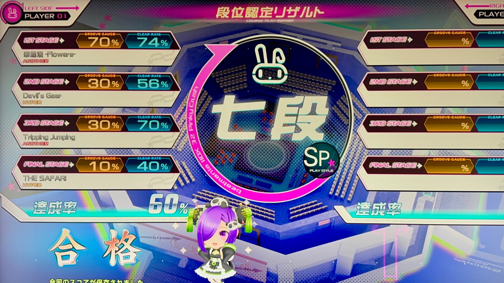
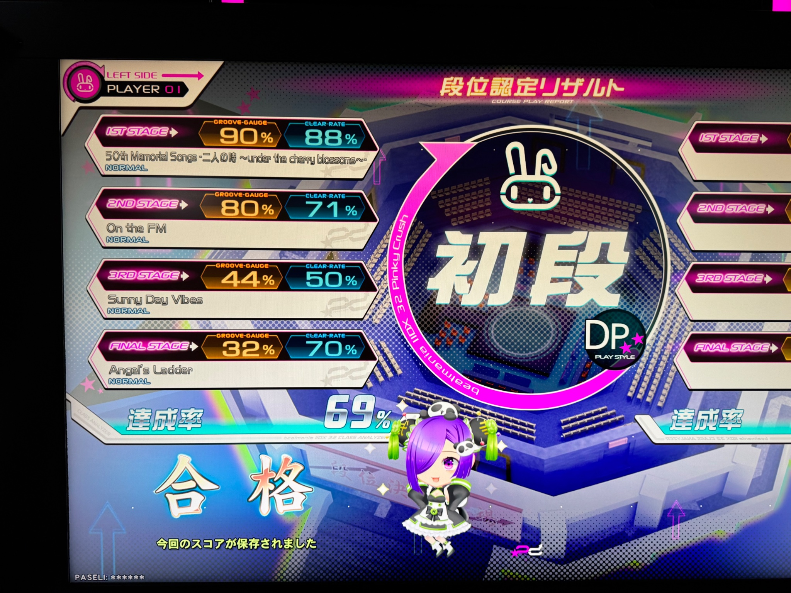

## 喜びの声

**7段合格、やったぞーーーーっ！！！！！**

3曲目終了時にゲージが30％前後で「今回もあかんかな～」と思ったらなんとか8%くらいでサファリ抜けられちゃいました。うっひょ～！

## このブログは何？
beatmania IIDX[^1]というゲームにおいて、決められた順番で4つの課題曲をプレイする「段位認定」モードのSP7段をクリアしたというご報告です。

[^1]: `iidx`はローマ数字の表記であり2DX(ツーディーエックス)と読む

もうそういう前置きいいかあ！長年クリアできなかった7段に受かったよ～いえいいえい✌🎊🎉というやつですやったーー！！！！！

## これまでの歩み

* PS2家庭用から入門、ゲーセンで初めてクレジット入れたのはたぶんLincle？
* その後ポップンやjubeatなど他機種が楽しくなり弐寺からいったん離れる
* 何となくまた家庭用のプレイを再開し、2か月後には家庭用HappySky/Distorted 6段・SINOBUZ 6段まで到達
* ながいながい万年6段生活のはじまり……
* ちょっと上達したかな？と思って7段受験するとだいたい3曲目でがっつりゲージが減って、ﾃﾚﾃﾚﾃｯﾃ→ｶﾞｼｬｰﾝといったパターン（地力不足）
* 別に7段受からなくても死ぬわけじゃあるまいし、他のゲームしてればいいしと思ってさほど力を入れてなかった
* 最新作Pinky Crushの収録曲が好みなのもあって熱が入った
* 7段より**さらなる高み**を目指してぇ……！！

## 合格までの道のり
前置きとして、プレイサイドは1P側です。
<small>機会があるか分からないけどカップルプレイのお誘いにも対応できるように2P側もちょっと練習してます。</small>

### ボタンを押せるようにする
このゲーム、ボタン押すのむっちゃ難しくないですか？  

鍵盤っぽい配置をしたボタンを、左手と右手の指をほぼフルに使って押すという特殊な動きを要求されます。さらにボタンから離れたところにあるスクラッチを回せ！となると、マジでボタンを押せませんでした。左手がちぎれるわ……。

ド初心者のころ、いろんな運指パターンを試してみて、これでやってみるか～となったものがしっくり来て、ボタンが思った通りにちゃんと押せた！と嬉しくなったのを思い出します。

段位認定で上を目指すぞー！となったとき、改めて運指を見直してみましたが「この配置には絶対この指」みたいなこだわりを捨てることを意識しました。 
 
ノーツ押せるなら/スクラッチできるなら、どんな手ェの形でもいい、ということに気づけたのかもしれない……。 

ということで初心者のころから[某式固定](https://www.google.com/search?q=1048%E5%BC%8F%E5%9B%BA%E5%AE%9A)でやっていたのを、某式+3:5半固定というスタイルになりました。  
連皿のときはちょっと崩して片手で鍵盤を頑張るとか、皿複合はこの指使いならいけるとか、運指にこだわらずにボタンを押しにいけるようになったのは一歩前進かなと思っています。

### 画面を見やすくする
長いこと家庭用TROOPERSあたりで時が止まっていたので、SUD+や緑数字は知っていても、LIFTやフローティングハイスピードなど、そういった便利オプションのたぐいは浦島太郎状態でした。  

フローティングハイスピード、マジで便利。SINOBUZ稼働時、初心者なりに頑張ってハイスピこれくらいかな～とか毎回調整していたあの頃の自分に「それやらなくてもいいよ？」と言ってあげたいくらいに……。  
オプションが深い階層に沢山あって、そこからもう~オタク向けすぎる~難しいゲームではありますが、初心者向けオプションの設定方法は一通り調べて損はないと思います。

カスタマイズについては月額課金しないといかんのでしょ～？と思っていましたが、なんとEPOLISから**ライトニングモデル筐体上で設定変更ができる**ようになったという情報を得たので、自分なりに視認しやすい状態に設定しました。

* キービーム: ショート
* ノーツの太さ: 太い
* ボムのサイズ: 80％

プレイしながら筐体上で好みの設定に詰めることができて本当助かる。これは良い仕様変更だなあと思います。<small>なんでいままで月額課金しないと変えられなかったんだろうね……。</small>

### いろんな譜面を遊ぶ  
やっと段位認定の話に戻ってきましたが、これに尽きる。  

6段に挑戦する時点でも感じていたことですが、このあたりのレベルからはいろんなタイプの配置や個性的な譜面が含まれるようになるので、ありとあらゆる種類の譜面を触るのがいいと思います。

触れるパターンを増やすということでは、RANDOMオプションをつけて、適正～ちょっと下レベルの曲をやるのも効果あるかも。  
好きな曲でやればモチベも上がりそうですし、家庭用やINFINITAS[^2]で遊べる曲が少ない場合には特に有効だと思います。

[^2]: 曲パックを揃えていないため真面目に取り組んでいません。でもキーボードで手軽に遊べるのはとっても良いと思う

いろんな傾向の譜面を触ることで、乱打は得意！皿複合は左手側がつらい！とか自分の得意不得意がちょっと見えてくる気がします。    
イケるやんって部分では、気持ち程度に、ほんのり脱力する。逆に苦手な配置が降ってきたら指運びに集中する、みたいな。中級者っぽいプレイ方法を学べた気がします。よくわからんけど。

### いっぱい遊ぶ
遊ぶ機会を増やしました。具体的にはおうちでも遊べるようにPS2と専コンを揃えなおしたり、海外製コントローラーを買ってみたり、INFINITASの曲パックをセール時に買ってみたり。  
とにかくボタンと皿を触る機会を普段より増やしました。自分の思うようにプレイできるまで、体にしっくりくるまで遊ぶのが大事。  

何よりPinky Crushの新曲がとっても好みで、アーケードでのプレイ回数が比較的増えたのも大きかったと思います。座学や予習はあまりせずに、とにかく新曲や未プレイ曲の、適正よりちょい上レベル帯のNORMALクリア（難しそうならEASYクリア）を目指しました。  

HARD狙いは集中したいときに気分転換にやってました。途中で落ちちゃうとリザルトのライバルスコアをつい見てしまって、気持ちがぐえーっとなるので、そういうときは潔くASSIST EASYをつけます。FAILEDになっても、MISS COUNTが減るのを見て「ちょっと上手くなったじゃん？」と思ってモチベを維持するようにしました。

多種多様な曲が収録されているゲームなので、お気に入りの曲を見つけにいくつもりで、ボタンと皿を触る時間を増やすぞ！という前向きな気持ちになれたのも影響として大きかったかなと思います。  

### THE SAFARIに囚われすぎない  
古来よりの言い伝えで「THE SAFARI（SP Hyper）は非常に独特な譜面であるため正規の粘着はやめよう」というものがあり、それを真に受けてサファリばっかりやるような粘着プレイはやりませんでした。

実プレイこそあまりしてはいないものの、軽く動画を見たり、曲を聴いて力の入れどころを意識するようにはしました。  
なんか3鍵がいっぱい降ってくるところがあって、左手もそうなんですが右手でもトリルが来るから沢山動かすべし、みたいなざっくりした予習程度ですね。  

段位認定自体も、さっぱりゲージが残らないときはもうぜーんぜんダメなので、そういうときはSTEP UPモードをやったりして段位自体の連続プレイをしないようにしました。  
なにやってもダメな時はマジでダメだし、指も動かないしノーツに目が追い付かないし。気持ちの切り替えはすぱっとできるようになったかなと思います。

冒頭にも軽く書いたんですが「別に7段受からなくても死ぬわけじゃあるまいし、他のゲームしてればいい」。  
幸いなことに（？）IIDXにはSPの逆サイドやDPといった、プレイ感覚が全く違う遊び方もありますし、好きな曲のBEGINNERやNORMALのフルコン狙ってみるとか、そういったものに手を出すのも（段位合格という視点では遠回りではあるけど）気分転換の方法として大いにアリだと思います。

今作の7段は1曲目（華爛漫だいすき）が同時押しと乱打要素あり、2曲目はトリル多め、3曲目が連皿と皿複合という感じでいろんな要素が散りばめられている感じでした。  
わたしは皿複合が苦手なので、3曲目でどれだけゲージを残してサファリに突入できるかの勝負になってました。不合格のときは大抵20%近くまで削られて、ﾃﾚﾃﾚﾃｯﾃ🦁で死💀といったパターンだったので、普段のプレイのときはレーダーのSCRATCHの部分を見ながら、お皿気持ち多めね！というふうに選曲するように心がけてみました。  

段位ばっかりやっててもたぶん合格はできないです。苦手・得意な要素を分かるためにも、やっぱ色んな曲をやるのが良さそうです。

## さらなる高みへ
いろいろ書いてみたものの

* 遊びやすい工夫をした
* 前向きに遊んだ

この2つをやれたおかげで、なんとかSP7段に合格できて *I'M SO HAPPY* という話でした。  
合格できたはずみでもっと上達したい！という気持ちもあるので、今作はガッツリ遊んでいきたいところです。

あとSPだけじゃなくてDPの楽しさにも気づいたので、こっちもちょっとずつ楽しんでいきたい。DPとかいう遊び方、プレイ感覚が違いすぎてオモロすぎる……！

