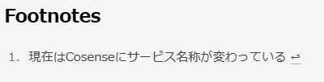

## 日記がつづかない
月報のやつやるか。

2年ほど前からScrapbox [^1] というwikiサービスを借りて、思いついたときに数か月分何をやっていたかの記録（月報？）をとるようにしていた。

Scrapboxはたくさんのページをリンクさせていくようなメモ・Wikiサービスで、思いつくままにページを作っていくのが気に入っていた。<br>
たくさん書いた項目が繋がっていくのは面白いが、自分用のメモや知見のまとめと、まったく同じレベルに雑～～な日記を置くのがどうにも気に入らなくて、あまり行動記録の目的で使っていなかった。

日記、続かないんすよ。なんか途中で飽きちゃうから。<br>
でも日記と名前をつけるからいけないのであって、これが週記とか月記ならまだなんとか書けるかもしれない……というところまで文章を打って、「そういえば月報って言葉があったな」と思い出した。

ということで月末あたりにまとめを更新することとする。まとめるためにはざっくり何やっていたかの記録が必要だけど、幸いなことに（？）Misskeyでほぼ毎日~思考垂れ流し~つぶやいているので、それを眺めていればなんとかなるでしょう。

## ブログのカスタムを進めている

このブログはmarkdownで書いているので脚注表記にも対応している。が、`<h2>`要素でやたら目立つし英語のままだし、なんだかイケてない……。



どうやっていじるんだろうと思い`Astro Footnotes`で検索すると先人たちの知恵を見つけた。

- [AstroJS で生成される Footnote (脚注) をカスタマイズする](https://xenexe.info/c07847cd-d1a2-4020-a9c1-7ed5790f1dec/)
- [[2023年6月版]Astro.js 小ネタ集 その2 Markdownの表示カスタマイズいろいろ](https://zenn.dev/asopitech/articles/20230604-012854_1)

曰く`astro.config.js`に追記すればいいらしい。というか[Astro公式ドキュメント](https://docs.astro.build/ja/reference/configuration-reference/#markdownshikiconfig)が丁寧に日本語化されていたので、ソースコードの海に漕ぎ出す前にこれをはじめに見ておくべきだった。あほですね。

`remarkRehype`のプロパティをちまちまといじってすっきりさせました。

```js
export default defineConfig({
  site: "https://harumakizaemon.net",
  integrations: [tailwind(), sitemap(), mdx(), pagefind()],
  markdown: {
    shikiConfig: {
      theme: "css-variables",
    },
    remarkRehype: {
      footnoteLabel: ' ',
      footnoteLabelProperties: { className: [''] },
      footnoteLabelTagName: 'hr',
    },
  },
});
```
Mastodon/Missey/Blueskyへのシェアボタンを各ページ下につけたいな～とか、やりたいことはそれなりにあります。<small>自己満足だけどいいでしょ別に、ここは俺のチラシの裏……</small>

せっかく好き放題できるブログなんだから、デフォルトのテンプレートのままじゃつまんないよね。ということで各種ナビゲーションをゆるめの言葉にしていい感じにしたり、分からないなりにいじっています。楽しい。

調べながら手を動かしてみて、思い通りになったときに「楽しい」「うまくいって嬉しい」とポジティブな感情が持てるうちは、まだまだITのお仕事やっていけるのかな～とふと思った。<br>
まあ、飽きたら日記と同じようにカジュアルに辞めたり始めたりするつもりです。そのくらいゆるい人生設計で今月もやっていこうと思います。


 [^1]: 現在はCosenseにサービス名称が変わっている。正直ピンとこないネーミングで、いつまで経っても新名称を覚えられない気がしている