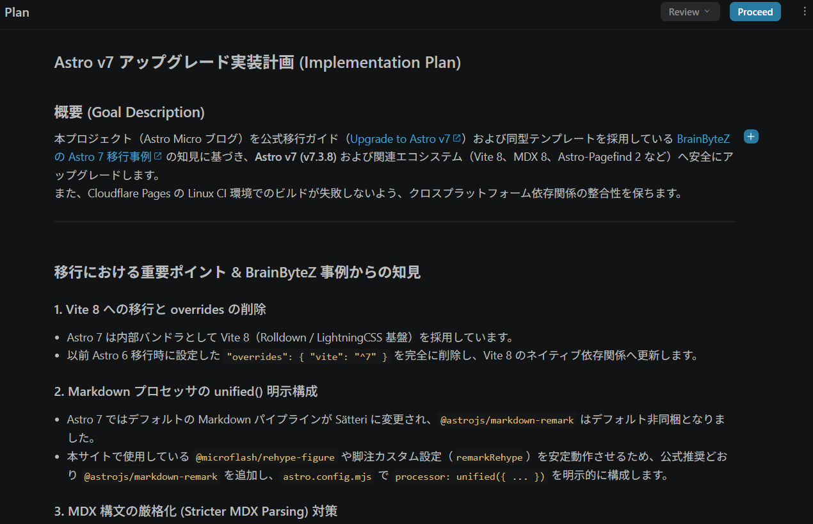
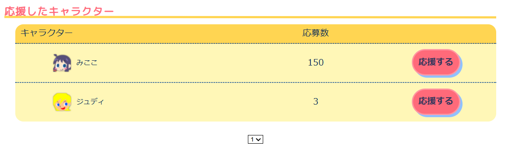

import Misskey from "@components/MisskeyNoteEmbed.astro";
import Fig from "@components/Figcaption.astro";

## ブログ改修しました

お久しぶりです。  
約1年ほど放置しているあいだに、各種記事に検索からアクセスいただいていたようで、閲覧感謝（これって死語？）です。

Quest Proに文句垂れてる記事とか  
（Metaから新型VRでるってよ！よかったね）  
Focus VisionやらMoflinやら、あまり詳細レビューのないガジェットの記事とか  
インターネットのどこかのだれかのお役に立てていれば幸いです。

このブログはAstroで構成しているのですが、Astroを最新版までbaajon appuさせるべく、AIに聞きつつ改修しました

便利な時代ですね。  
おかげでブログ更新のための重た～い腰をあげるのが多少楽になりました。

当WebサイトではAIではなく、人間によるあたたかい手作りのSlopをお届けすることをお約束します。

気が向いたら更新しますので、今後ともよろしくお願いします。

## 報告

更新していなかった時期にあったトピックを箇条書きでもするか。

- Resoniteが正式リリース3周年
    - めでてぇ🎉
    - 相変わらずふらふらと遊んでいます。見かけたら優しくしてください
- まねっこダンス部 in Resoniteが2周年
    - めでたいことに、みんながダンスしてるところが見たいという不純（？）な動機からはじめたまねっこダンス部が2周年を迎えることができました 
    - 毎週来てくれるひと、思い出したときに見に来てくれるひと、文字SNSでリポストいいねをしてくれるひと、各位に盛大に感謝です
    - そしていつもいつもお世話になっている共同主催・ミラシュカさんにも大変感謝です🙇
- 新しいおうちにひっこしました
    - VRと電子ドラム（！）のためのお部屋ができました
    - 1年経ったけどまだ解いてない段ボールがある。片づけなきゃな
- [IIDX] DPはじめました
    - すぱしゃからDPに取り組むようになり、ZINRAI現在 **SP7段 / DP6段** 取得しました！！<Fig caption="カードコネクトで認定証も印刷するくらい嬉しかった"><Misskey noteId="arei5c8qv8" UUID="071137b2-44cd-4723-81d9-43adedb6bb66" /></Fig>
    - DPって好きな曲の遊び方が増えるからいいよね
    - SPもDPもより上を目指したいので、今一番がっつり遊んでいきたい機種です
    - じつはライバルとかほしい。けど無言で片道申請していいものなのか分からず……。
- [DDR] 相変わらず続けています
    - 段位認定来ましたがこちらは **SP8段/DP7段**
    - 他の音ゲにもクレジット割くようになったので、ノンバーでゆるゆると遊んでます
- [POPN] 新筐体ありがとうね
    - ピカピカポップ君筐体がホームゲーセンに2台置かれるようになり、モチベがもちもちと上がっています
    - SUKIキャラグランプリも始まったので、遊べるときは**みここちゃん**にがっつり投票しております  
    - みここちゃんに新規担当曲ほしいぜ……
- [DRAM] 実はドラマニはじめました
    - 家族がゲーセンのGITADORA（ドラム）にハマり、わたしもちょこちょこと遊んでいたら新居がこうなっていました <Misskey noteId="ao9h0vt7yp" UUID="ee796928-e9f8-4c5a-9dd7-4f4c876a7bde" />
    - AC版もコナステも青ネームまではどうにか来れました
    - 足と腕で別々のリズムを取るのが独特で面白い
    - GITADORAのGITAのほう、ギターフリークス部分はあまり面白さが分からずやってないです……。
        - 旧筐体のペダル踏んでエフェクトつけるのが下手なりに好きだったんだけど、どうしてそういう「遊び」の部分を無くしちゃうかなーと思った

つもる話もいっぱいあるので、そのうちまとめて更新していきますかね

ではまた👋