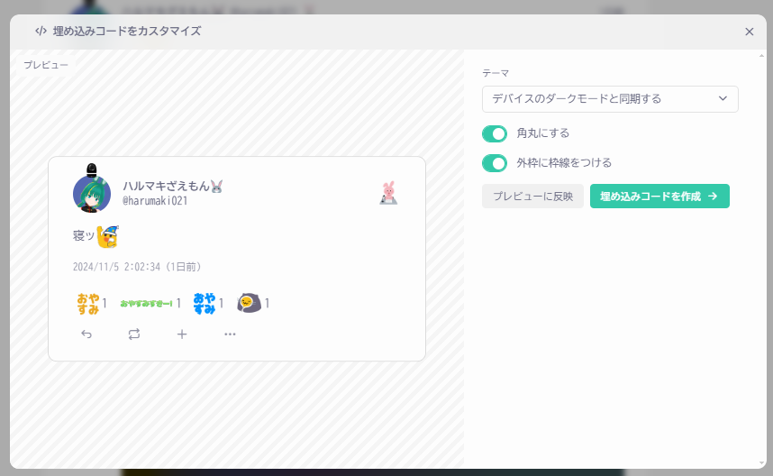
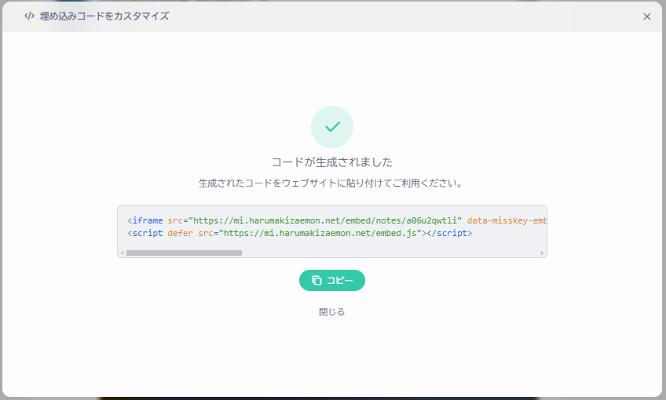
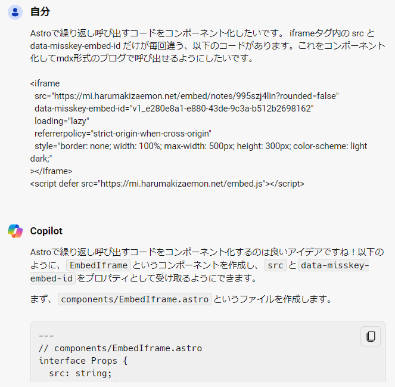
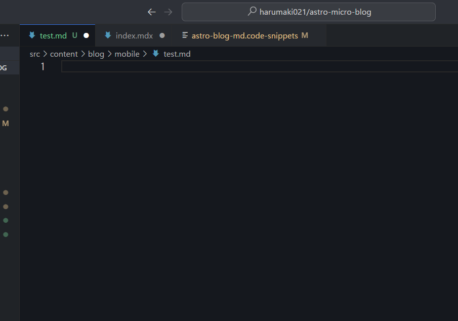

import Misskey from "src/components/MisskeyNoteEmbed.astro"

## 待望の埋め込み機能追加
Misskey v2024.9.0において、外部サイトでのノート埋め込み表示機能が追加されました。  

<Misskey noteId="a06u2qwtli" UUID="bc1fbd79-9e40-4247-8f6d-fbbe32a44735" />

こんな感じで、Misskeyの投稿をブログに張り付けられます。

ちゃんと添付ファイルも表示されるし、カスタム絵文字やMFM（けたたましく動き回るアニメーションとかがつくれる独自記法）にも対応していて、非常に見栄えがいい。  
文章ばかりのページでも、こういうのがあったほうが目を惹きやすいと思う。<small>内容しょうもないけど……</small>  

単一のつぶやき（ノート）だけではなく、特定ユーザーのノート一覧や、クリップの埋め込みにも対応しているとのことだったので、 [TOP](/) や [Aboutこなつ](/projects/lovot-konatsu) ページにウキウキで埋め込んでみました。  

## 使い方
対応バージョンのMisskeyから生成されるコードを張り付けるだけ。

これが


こうなって


出来上がったコードがこちら。

```html
<iframe
 src="https://mi.harumakizaemon.net/embed/notes/a06u2qwtli" 
 data-misskey-embed-id="v1_5f7611e1-770b-4928-acf4-1cefa2ef0d9a" 
 loading="lazy" 
 referrerpolicy="strict-origin-when-cross-origin" 
 style="border: none; width: 100%; max-width: 500px; height: 300px; color-scheme: light dark;">
</iframe>
<script defer src="https://mi.harumakizaemon.net/embed.js"></script>
```

Misskeyの投稿をいい感じにブログや自分のWebサイトに表示した～いとなったらこいつが使えるってわけですわ。  
はてなブログであれば [HTML編集モード](https://help.hatenablog.com/entry/editor/textarea) にして、上記のコードを本文に張り付ければOK。  

## コードを使いまわしたい: コンポーネント化しよう

このブログはせっかくAstroを使っているので、HTML+JSなコードはいろんなところで使いまわせるようにしたいですよね。

あと毎回埋め込みコード生成するのも面倒だし、markdown(mdx)で書いているので、単一のノートを埋め込むときは1行で簡単にすませたい。

```html
<Misskey noteId="{埋め込みたいノートのnoteId}" embedId="{ランダムな文字列}" />
```

☝こういうイメージね。

調べてみると、Hugoで同様のことをやっている先駆者さま[^1]がいらっしゃいました。  
[Misskeyの埋め込みをHugoで利用する :: s1ck h4ck](https://4nm1tsu.com/posts/uhz4czt/)

[^1]: このアカウント、どこかで……と思ったら [Misskeyで繋がってる方](https://misskey.4nm1tsu.com/@4nm1tsu) でした。

共通化できる部分はどしどしコンポーネントにしましょう、ってAstroのチュートリアルにも書いてあったような気がしますし、わたしもCopilot先生に聞きながら実際にやってみました。



### 埋め込みコードの仕様

[MisskeyHubのドキュメント](https://misskey-hub.net/ja/docs/for-users/features/embed/) を見てみると、`noteId`と`data-misskey-embed-Id`を変数として渡してあげればいいみたい。  

> \<NOTE_ID\>: 埋め込むノートのID  
> \<RANDOM\>: ランダムな文字列（embed.jsを使用する場合は必須。埋め込みコードが同じページに複数ある場合は被らないようにしてください）
> 
> https://misskey-hub.net/ja/docs/for-users/features/embed/

つまりそれ以外の部分は共通化できそうです。やってみよう。

### ランダム文字列どうするか問題

まずはノート埋め込みコンポーネントとして切り出します。ちなみにコードはほとんどcopilot先生に書いてもらいました。ｼｭｺﾞｲ

```astro
---
//  src/components/MisskeyNoteEmbed.astro 
import { randomUUID } from 'crypto';

interface Props {
  noteId: string;
}

const { noteId } = Astro.props;
const src = `https://mi.harumakizaemon.net/embed/notes/${noteId}?rounded=false`;
const embedId = `v1_${randomUUID()}`;
---

<iframe
  src={src}
  data-misskey-embed-id={embedId}
  loading="lazy"
  ……
```

ただ、この方法だと `data-misskey-embed-id` のランダム文字列の生成に、Node.jsの`crypto`モジュールを使っていました。  

テスト環境で検証してみたところ、ページをリロードするたびに生成される文字列が変わっています。

別に毎回ランダムにする必要はないな～と思ったので、`.mdx`ファイルの段階で、生成した乱数を書き込んでおくことにしました。  

やり方はいろいろあると思いますが、今回はVSCodeのSnippet機能を使います。  

### SnippetでUUID変数をつかう

VSCodeにはSnippetという機能があり、コードのひな型をあらかじめ用意しておいて、簡単に呼び出せます。

`.vscode`フォルダの中に規定の書式で書いておけば、いろんなところでテンプレート的に呼び出せてむっちゃ便利です。

詳しい記法は先人たちの知恵に任せるとして、こんな感じでブログのmarkdownファイル用にSnippetを作ってました。

```json
// .vscode/astro-blog-md.code-snippets
{
  "AstroBlogTemplate": {
    "scope": "",
  "prefix": "blog",
  "body": [
    "---",
    "title: ${1:タイトル}",
    "description: ${2:説明}",
    "date: ${CURRENT_YEAR}-${CURRENT_MONTH}-${CURRENT_DATE}",
    "draft: false",
    "---",
    "",
    "## ${4:h2}"
  ],
  "description": "ブログ用てんぷれ"
  },
　……
}
```

で、このSnippet、↑の`${CURRENT_YEAR}`のような表記をすることで、現在の年月日やファイル名など、いろんな変数を扱うことができます。

「VSCode Snippet 変数 🔍」で検索してみると、都合がいいことに（？）、ランダム文字列の生成もできてしまうむっちゃすごいやつでした。  

> For inserting random values:
>   * **RANDOM** 6 random Base-10 digits
>   * **RANDOM_HEX** 6 random Base-16 digits
>   * **UUID** A Version 4 UUID
> 
> https://code.visualstudio.com/docs/editor/userdefinedsnippets#_variables 

乱数の生成は3つほどあり、UUIDがよさげだったのでこれを使います。

### Snippetの設定

`"body"`の部分にテンプレで埋め込みたい文字列を書いていきます。  
つくりたいテンプレ文はこんな感じ。

```html
<Misskey noteId="${1:noteId}" UUID="$UUID" />
```

`${1:noteId}`の部分はプレースホルダです。カーソルが自動で合わさって便利。  
`$UUID`で乱数を生成します。  
ついでにimportもプレースホルダに入れて、最後にダブルクォートを `\` でエスケープしてあげればOK。

```json
{
  "AstroBlogTemplate": {
    ……
  },
// ここから追加
  "MisskeyNoteEmbed": {
  "scope": "",
  "prefix": "misskeyNote",
  "body": [
    "${1:import Misskey from \"src/components/MisskeyNoteEmbed.astro\"}"
    "<Misskey noteId=\"${2:noteId}\" UUID=\"$UUID\" />"
  ],
  "description": "MisskeyのNoteうめこみ用"
  }
}
```

VSCodeでSnippetを呼び出すと……



自動でランダム文字列が生成されるようになりました！

これで、埋め込みたいノートのnoteIdを張り付けて補完できるようになりました！やったね～

しかもGithubからリポジトリをクローンしてきたら、そのままSnippetが使えます。  
macとWindows機を行き来しても、出先のPCからStackBlitzで書いても、同じ方法で簡単に補完できるようになりました。

## 最終的にこういう流れになった

Astroコンポーネントはこんな感じ。noteIdとUUIDを受け取って、埋め込みコードに渡します。

別のサーバーの投稿を埋め込むなら `mi.harumakizaemon.net` の部分も変数にしてよさそう。

```astro
---
//  src/components/MisskeyNoteEmbed.astro 
interface Props {
  noteId: string;
  UUID: string;
}

const { noteId } = Astro.props;
const { UUID } = Astro.props;
const src = `https://mi.harumakizaemon.net/embed/notes/${noteId}?rounded=false`;
const embedId = `v1_${UUID}`;
---

<iframe
  src={src}
  data-misskey-embed-id={embedId}
  loading="lazy"
  referrerpolicy="strict-origin-when-cross-origin"
  style="border: none; width: 100%; max-width: 500px; height: 300px; color-scheme: light dark;"
></iframe>
<script is:inline defer src="https://mi.harumakizaemon.net/embed.js"></script>
```

実際のブログ本文にはこう書きます。コンポーネントを埋め込むので、`.md`形式ではなく`.mdx`形式にする。

```astro
---
//  src/content/blog/hogehoge/index.mdx
title: タイトル
description: 説明
date: YYYY-MM-DD
draft: false
---

import Misskey from "src/components/MisskeyNoteEmbed.astro"

<Misskey noteId="a06u2qwtli" UUID="9df013e3-3a67-4fe1-8e45-9a61a95bdd14" />
```
ということでまた一つお勉強が進みました。本当AIさまさまですわ……。
