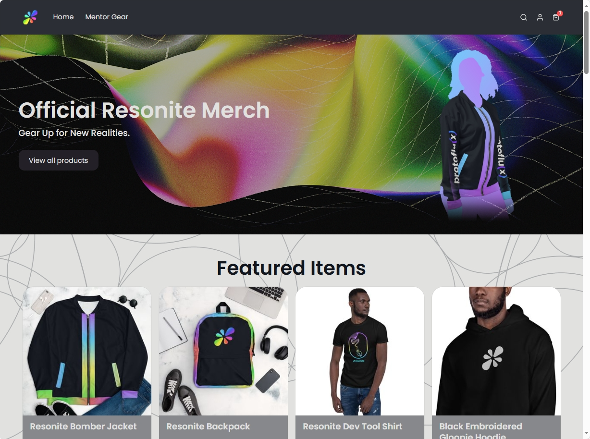

この記事は書きかけです。

## Resonite公式通販をしっているか

- [Resonite公式の通販サイト](https://resonite.sellfy.store/)が存在する
- resonite.comトップページ→メニュー→Merchから

- Shipping: WorldWideとなっているので、日本からの注文でも届くはず
  - 配送料は別途かかるみたい。カートから住所入力すると確認できて、約4ドルでした。オーダーによって変動するかもなので都度確認するとよい。

## カート画面の詳細
- 注文情報のフォームを眺めてみる
  - Country>Japan（日本）
  - State>都道府県
  - ZIPcode>郵便番号
  - City>市
  - Address>以降の住所・部屋番号
  - PhoneNumber>電話番号（注文に問題があったときに連絡がするために電話がかかってくるかもよ、的なことが書いてある）
  - Ordering as a company/businessは法人注文用のチェックボックス
- 決済はPayPalかクレジットカードが選択可能
- ページ下部に[「Customer Support」](https://resonite.sellfy.store/contact/)がある。背景が黒なうえに文字色が茶色でクッソ見づらいけど、Webフォームからお問い合わせが送れそう

## 気になるアイテム
### ファッション系
- Tシャツ
  - ロゴだけの[シンプルなやつ](https://resonite.sellfy.store/p/resonite-dev-tool-mentor-shirt-tmus3z/)から、ツールチップのデザインをつかった[スタイリッシュめなやつ](https://resonite.sellfy.store/p/resonite-dev-tool-sleeveless-moderator-shirt-m0rb1w/)まで
    - 色合いが派手
  - [Mentorシリーズ](https://resonite.sellfy.store/p/resonite-dev-tool-moderator-shirt/)は緑色っぽいデザイン
     - 着ているだけでおれはメンター（公認の案内人）だぞとアピールできる
- ジャケット
  - [bomber jacket](https://resonite.sellfy.store/p/protoflux-bomber-jacket/)ってなんだろ
  - 色合いが派手2
- キャップ・ビーニー
  - ワンポイントでロゴが入った[ビーニー](https://resonite.sellfy.store/p/resonite-beanie/)。ほしい……！
- パンツ
  - [LocalHomeの地面の模様](https://resonite.sellfy.store/p/harmonic-spirals-wide-leg-pants/)がモチーフ？
- ヨガパンツ
  - [なぜヨガなんだ](https://resonite.sellfy.store/p/harmonic-spirals-yoga-pants/)
### グッズ系
- 缶バッジ
  - [ロコモーション](https://resonite.sellfy.store/p/locomotion-badges/)（歩行・飛行・ノークリップなど）
  - [ネームプレートの上につくバッジ](https://resonite.sellfy.store/p/resonite-badges/)（ホスト・メンター・デバッグチームなど）
- ステッカー
  - [シンプルにロゴ](https://resonite.sellfy.store/p/gloopie-sticker-3/)。PCやHMDにぺたぺた貼って強火オタクアピールできそう。
- マグカップ
  - [普通サイズ](https://resonite.sellfy.store/p/resonite-mug/)・クソでかな[トラベラーサイズ](https://resonite.sellfy.store/p/resonite-travel-mug/)あり
### 謎
- ヨガマット
  - [なぜヨガなんだ2](https://resonite.sellfy.store/p/spherical-harmonics-yoga-mat/)
  - ヨガパンツと併せて全身Resoniteヨガ、しよう！
- ジグソーパズル
  - Resoniteロゴの色を使った[グラデーションだけのパズル](https://resonite.sellfy.store/p/resonite-gradient-puzzle/)
  - 色だけなんだ（Homeワールドの写真とかじゃないんだ）
- マウスパッド
  - [LocalHome柄](https://resonite.sellfy.store/p/harmonic-spirals-mousepad/)と[くっそ派手なデザイン](https://resonite.sellfy.store/p/gloopie-mousepad/)の2種
- エプロン
  - [「Chef froox」](https://resonite.sellfy.store/p/chef-froox/) 開発者のFrooxiusさんの名前が入っている
- ペット用のごはん皿
  - [なにこれ？](https://resonite.sellfy.store/p/resonite-pet-bowl/)
  - [メンターマークがついてるバージョン](https://resonite.sellfy.store/p/mentor-pet-bowl/)もある、なんなんだこれ（困惑）

## WeaverseLabから公認グッズも出た

[WeaverseLabのオリジナルグッズ・アイテム通販 ∞ SUZURI（スズリ）](https://suzuri.jp/WeaverseLab)

- Resoniteの日本代理店WeaversLabでもResoniteグッズの販売を開始
  - suzuriで購入できる。国内通販
  - 「Resonite」で検索しても出てこない（なんでだろう）
- 現在の取り扱いはTシャツ、サコッシュ、マスク、クッションなど
- [デザイン一般公募企画](https://x.com/WeaverseLab/status/1911994332686811303?utm_source=yjrealtime&utm_medium=search)もやるらしい
  - Resonite公式に確認をとったうえで、公認グッズとして販売されるとのこと
  - もたもたブログ記事をあたためていたら公募期間終了してました。楽しみだね

## いかがでしたか
私はWeaverseLabでサコッシュ黒とLife is no clipTシャツを買いました。

＠＠ここにサコッシュとTシャツの写真が入る＠＠

サコッシュはすこし大き目で、横長の財布も余裕で入るサイズでした。取り出し口はスナップボタンが付いていて留めることができました。小物を入れるときはポロリに注意だね

Tシャツはいろいろなカラーから選択可能です。Life is no clipはデザインが白いので、暗めの色のほうが映えるかなと思ってスレートにしました。実物は緑がかった濃いめのグレーといった感じ。suzuriのTシャツは何枚か購入したことがあり、プリント部分や布地の耐久度はそこそこあると思います。

どちらも満足感高いし、普段使いできそうなのでどんどん使っていこうと思います！

ちなみにオーダーのときに数量を間違えてしまい、サコッシュが2つ届きました（クソアホ）。保存用として取っておくことにします。

-----
というわけで、現時点で入手できるResonite公式・公認グッズのまとめでした。ほしいやつはあったかな？

グッズと聞いたらついつい買ってしまうオタクの習性にこたえるVRアプリ、それがResoniteということだね……！

公式通販も一回オーダーしてみたい。ビーニーはかなり欲しい！